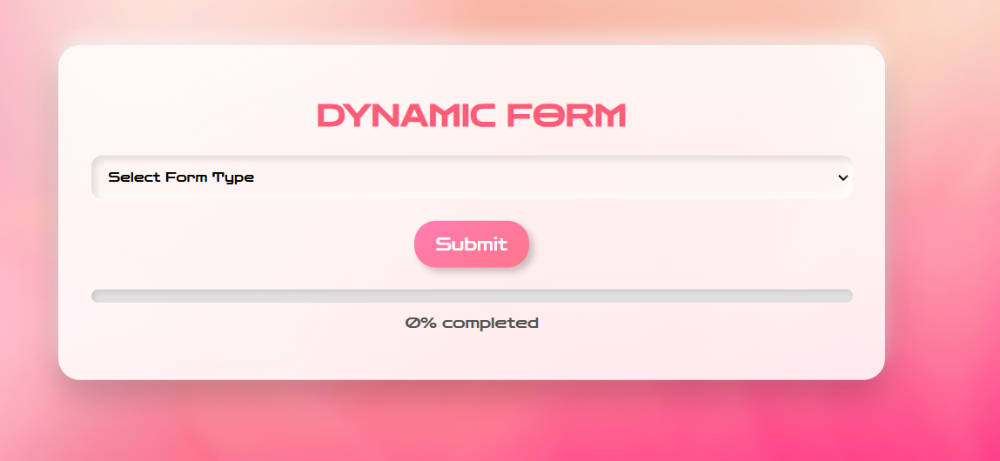

# 🌟 Dynamic Form Generator  

*A powerful and responsive form generator built with React. Designed to simplify data collection with dynamic fields, real-time progress tracking, and a sleek, user-friendly interface.*  

---

## 🚀 Features  

- **Dynamic Form Selection**: Generate form fields on the fly by choosing predefined categories.  
- **Responsive Design**: Optimized for all screen sizes, from desktops to mobile devices.  
- **Interactive Progress Bar**: Real-time feedback on form completion progress.  
- **Error Handling**: Ensures all required fields are filled with intuitive prompts.  
- **Data Visualization**: Submitted data is displayed in a structured and readable table.  
- **Modern UI**: Aesthetic design using soft shadows, gradients, and animations.  

---

## 🎯 Use Cases  

- Dynamic multi-step forms.  
- Online surveys and questionnaires.  
- Data entry tools with validation.  
- Educational and personal projects showcasing React and CSS skills.  

---

## 🛠 Tech Stack  

- **React.js**: For building dynamic and interactive user interfaces.  
- **CSS3**: For styling and animations.  
- **JavaScript (ES6+)**: For seamless interactivity and functionality.  

---

## 📷 Screenshots  

### 🌐 Home Page  
 
*A clean and responsive layout for easy navigation.* 

 

### ✍ Form Example  

*Dynamic fields with error handling and progress tracking.*  

---

